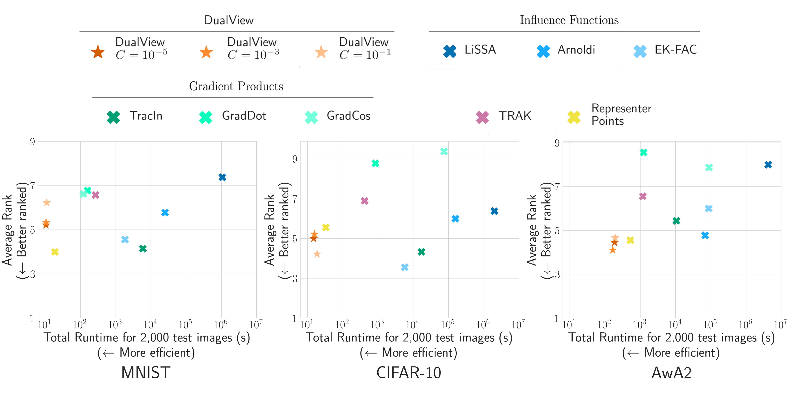
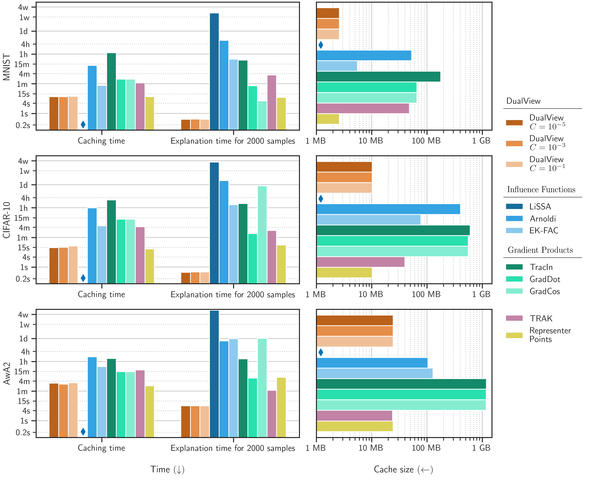
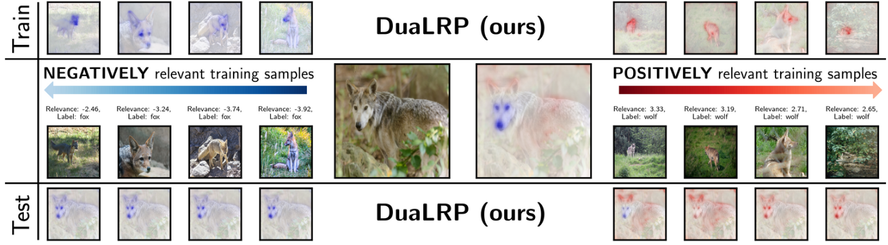

# THIS REPOSITORY IS UNDER CONSTRUCTION

We will shortly update our paper [DualView: Data Attribution from the Dual Perspective](https://arxiv.org/abs/2402.12118) and this repository will hold all the code reqiured to reproduce our new results!

## DualView

DualView is a runtime-efficient Training Data Atrribution (TDA) method which produces explicitly sparse attributions. Our experiments show that DualView performs at the state-of-the-art level with minimal computational cost. Furthermore, the attributions of DualView are sparse by design, resulting in explanations that are more easily digested and analyzed by humans in practice.

## Results

Our study measures the attribution quality of all prominent TDA methods from the literature, comparing them to DualView, using 7 quantitative metrics that are proposed in the literature. The figure below showcases the remarkable performance of DualView, which achieves fastest total explanation times at the same time with lowest average ranks over evaluation metrics.

Furthermore, DualView requires the least amount of computational resources:

## DuaLRP

Furthermore, the attributions of DualView can naturally be understood as Layerwise Relevance Propagation (LRP)style relevances. LRP is a method for feature attribution. Establishing this connection, we are able to go beyond TDA, and go into the train **and** test pixel attributions to see **why** certain training datapoints are deemed important for a **specific** test point.

For example, in the image above, the test prediction of class "wolf" is being explained. The negatively attributed datapoints showcase that the eyes and the snout of the wolve constitutes evidence for the class fox from the model's perspective. Whereas the positively attributed datapoints show that even though the model recongizes the wolf faces as evidence, it is relying mostly on background and fur.

Therefore, we understand why the total LRP heatmap (in the middle), has positive attributions on the background and body but highly negative attributions around the face of the animal.
