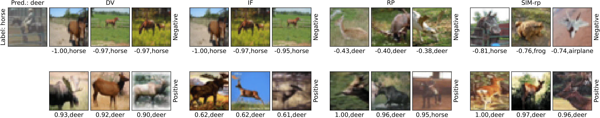
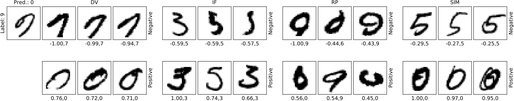
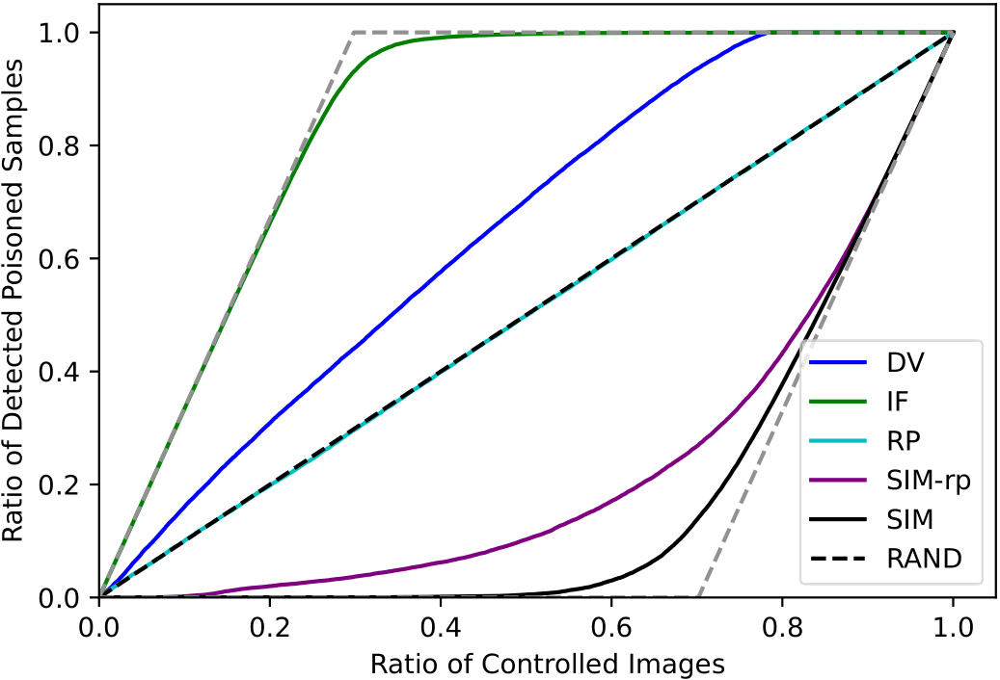
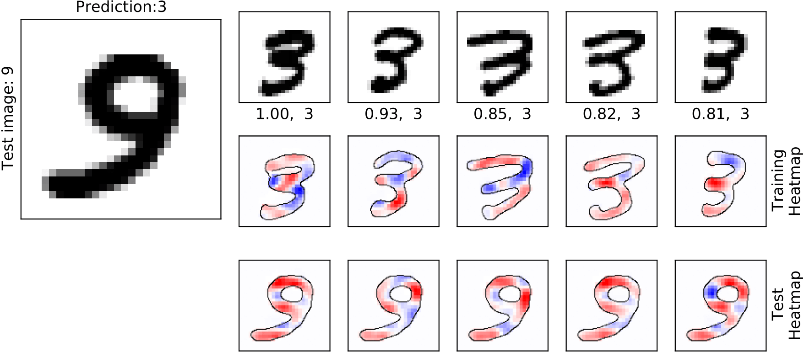

This repository implements the experiments for the paper [DualView: Data Attribution from the Dual Perspective](https://arxiv.org/abs/2402.12118)

The repository contains the code used to generate and evaluate post-hoc local data attribution of torch models using four evaluation criteria and four explanation methods. These include DualView, Influence Functions and Representer Point Selection. [Shark ML library](https://github.com/Shark-ML/Shark) has been used for DualView explanations. Open source implementations have been used for [Influence Functions](https://github.com/nimarb/pytorch_influence_functions) and [Representer Points](https://github.com/chihkuanyeh/Representer_Point_Selection).

# Prerequisites
Shark ML requires Boost and CBLAS. A requirements file is given for Python packages.
Before running the scripts, the placeholder directories should be replaced in the configuration files. This is done easily via the notebooks given in the config_files folder. After replacing <dataset_root> with the directories where the MNIST and CIFAR-10 datasets are found, and <project_root> with the root of this repository, run the notebook to generate configuration files. 

Finally, checkpoints of models trained on different modifications of the datasets can be found [here](https://datacloud.hhi.fraunhofer.de/s/wnjRb45mFeo8Af8) to reproduce results. Otherwise, the checkpoint roots of models should be changes accordingly for configurations files to work. The explanations generated for these checkpoints can be found [here](https://datacloud.hhi.fraunhofer.de/s/AG3MNJ42rGBRyCx) to directly evaluate and reproduce the paper results.

The namings in the configuration and checkpoint directories indicate the dataset (*MNIST* for MNIST and *CIFAR* for CIFAR10 ), and the dataset type that is used for evaluation (*std* for vanilla datasets, *group* for datasets with superlabels, *corrupt* for dataset with corrupted or poisoned labels, *mark* for datasets with watermarked or perturbed datapoints.)

# Generating explanations
Explanations are generated by the explain.py script by giving it one of the configuration files in config_files/explain/. Explanations will be saved in a folder *'explanations'*.
The *batch_size* and *number_of_batches_per_file* fields should be changed according to the explanation method and computational resources available.

    cd src
    python explain.py --config_file ../config_files/explain/MNIST/basic_conv_std_dualview.yaml

Once explanations on vanilla datasets are generated, we can plot them using the comparison scripts:

    python examples_comparison.py --config_file ../config_files/comparison/MNIST.yaml
   
Here are example results:

# Evaluating explanations
Evaluation is done using the evaluate.py script and the results will be stored in the *results* folder.
    
    cd src
    python evaluate.py --config_file ../config_files/evaluate/CIFAR/resnet_corrupt_influence.yaml

After evaluating different methods with the Label Poisoning Experiment metric, the results files can be stored in a directory to use the *plot_poisoning_curves.py* to plot the poisoning detection curves produced by the explanations.

Evaluation configurations can be used to generate feature-level attributions on vanilla datasets using DualView or Representer Points explanations:
    
    python examples_comparison.py --config_file ../config_files/evaluate/CIFAR/resnet_std_dualview.yaml

